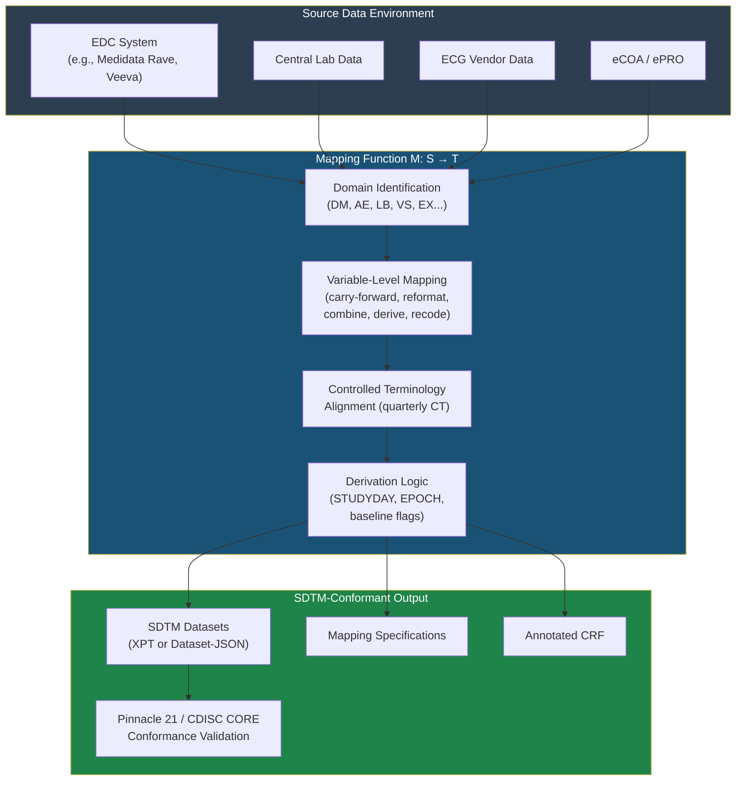
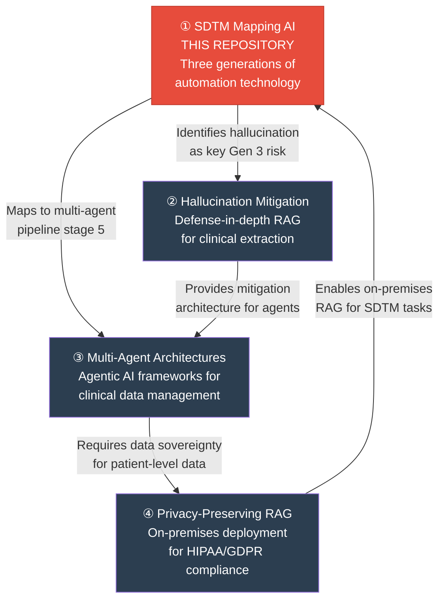

<p align="center">
  <strong>Automating SDTM Mapping with Artificial Intelligence and Large Language Models</strong><br/>
  <em>A Narrative Review</em>
</p>

<p align="center">
  
  
  
  
</p>

<p align="center">
  <a href="#the-problem">The Problem</a> •
  <a href="#regulatory-landscape">Regulatory Landscape</a> •
  <a href="#three-generations-of-automation">Architecture</a> •
  <a href="#key-findings">Key Findings</a> •
  <a href="#research-program-context">Research Program</a> •
  <a href="#citation">Citation</a>
</p>

-----

## The Problem

The CDISC Study Data Tabulation Model (SDTM) is **mandated by the U.S. Food and Drug Administration** for regulatory submissions of clinical trial data. Manual SDTM mapping — the process of transforming raw study data into SDTM-conformant datasets — remains the single most resource-intensive bottleneck in the clinical data pipeline:

- **35–45 programmer hours** per dataset
- **6–8 weeks** end-to-end per study across 15–25+ domains
- **$50,000–$200,000+** estimated cost per study (industry extrapolation; not empirically validated)
- Each day of submission delay carries **significant commercial implications** for pharmaceutical sponsors

This narrative review provides a critical assessment of automation technologies applied to this challenge across three technology generations, synthesizing the highest-quality available evidence while explicitly identifying where the field’s promise outpaces its published proof.

-----

## Paper Statistics

|Attribute                 |Value                                                                                                                                                                 |
|--------------------------|----------------------------------------------------------------------------------------------------------------------------------------------------------------------|
|**Word Count**            |~7,000 (excluding references and tables)                                                                                                                              |
|**References**            |30 (4 peer-reviewed journals, 7 regulatory documents, 6 conference proceedings, 4 vendor white papers, 3 preprints, 3 industry commentary, 3 open-source repositories)|
|**Tables**                |3                                                                                                                                                                     |
|**Systems Reviewed**      |8 (across 3 technology generations)                                                                                                                                   |
|**Evidence Quality Tiers**|Peer-reviewed → Conference → Vendor claims (explicitly labeled throughout)                                                                                            |

-----

## Intended Audience

- **Regulatory affairs professionals** evaluating AI-assisted submission workflows
- **Clinical data standards architects** designing SDTM automation strategies
- **Pharmaceutical technology leaders** assessing build-vs-buy decisions for SDTM tooling
- **Academic researchers** in clinical informatics and biomedical NLP
- **Legal and compliance counsel** reviewing AI deployment in regulated data pipelines

-----

## Regulatory Landscape

This work intersects the following regulatory and standards instruments:

|Instrument                         |Specific Provision                              |Relevance to SDTM Automation                                                                                      |
|-----------------------------------|------------------------------------------------|------------------------------------------------------------------------------------------------------------------|
|**FDA Federal Register 2023-27310**|88 FR 86336–86337 (Dec 13, 2023)                |Mandates SDTM v2.0 / SDTMIG v3.4 for NDAs, ANDAs, BLAs, INDs effective March 15, 2025                             |
|**FDA Study Data TCG v5.9**        |October 2024 revision                           |Governs regulatory implementation of SDTM; conformance validation requirements                                    |
|**CDISC Controlled Terminology**   |Quarterly releases (most recent: March 27, 2026)|~1,124 new terms per release; all automation systems must track evolving vocabulary                               |
|**CDISC Dataset-JSON v1.1**        |Published December 5, 2024                      |Intended replacement for legacy SAS XPT transport format                                                          |
|**FDA Draft AI Guidance**          |January 2025                                    |Transparency, explainability, and documentation framework for AI in drug development                              |
|**21 CFR Part 11**                 |Electronic Records; Electronic Signatures       |Audit trail requirements applicable to AI-generated SDTM datasets                                                 |
|**EU AI Act**                      |Regulation 2024/1689 (in force August 1, 2024)  |Potential high-risk classification for clinical data standardization tools                                        |
|**CDISC 360i**                     |Public kickoff February 18, 2025                |Machine-executable metadata via formal ontologies; could shift paradigm from pattern recognition to rule execution|

-----

## Three Generations of Automation

The review organizes existing approaches into three generations based on their core computational paradigm — a classification reflecting chronological progression already evident in the literature rather than a novel taxonomy proposed by this paper.

```mermaid
flowchart LR
    subgraph G1["Generation 1 — Metadata-Driven"]
        G1A["SAS Macro Libraries"]
        G1B["Metadata Repositories"]
        G1C["Template Reuse"]
    end

    subgraph G2["Generation 2 — Supervised Machine Learning"]
        G2A["Binary/Multiclass<br/>Classification"]
        G2B["Siamese Neural<br/>Networks"]
        G2C["Embedding Similarity<br/>Matching"]
    end

    subgraph G3["Generation 3 — LLM / Agentic AI"]
        G3A["Retrieval-Augmented<br/>Generation (RAG)"]
        G3B["Multi-Agent<br/>Orchestration"]
        G3C["GPT-Based Code<br/>Generation"]
    end

    G1 -->|"Limitations:<br/>Inflexible to<br/>study variability"| G2
    G2 -->|"Limitations:<br/>Requires large<br/>training corpus"| G3

    style G1 fill:#1a5276,color:#ffffff
    style G2 fill:#1a5276,color:#ffffff
    style G3 fill:#1a5276,color:#ffffff
```



### Comparative Analysis

|Feature                   |Gen 1: Metadata-Driven                         |Gen 2: Machine Learning                                          |Gen 3: LLM / Agentic AI                                                 |
|--------------------------|-----------------------------------------------|-----------------------------------------------------------------|------------------------------------------------------------------------|
|**Core Technique**        |Reusable SAS macros; metadata repositories     |Supervised classification; Siamese networks; embedding similarity|RAG; multi-agent orchestration; GPT-based code generation               |
|**Representative Systems**|Pinnacle 21 + Formedix; sponsor macro libraries|JETConvert (Bioforum); Siamese classifier (Medidata); AbbVie AI  |Saama SDTM Navigator; PHUSE two-stage RAG; PharmaSUG China GPT framework|
|**Domain Accuracy**       |N/A (template-based)                           |75.1% (Bioforum, 41 trials) → >90% (Medidata)                    |~70% initial accuracy (Saama)                                           |
|**Variable Accuracy**     |40–60% reuse rate                              |83.8% (Bioforum, 61 trials)                                      |Confidence-scored; benchmarks not yet published                         |
|**Time Reduction**        |Moderate (reuse savings)                       |Moderate (training corpus required)                              |50–70% reported (Saama)                                                 |
|**Primary Limitation**    |Cannot adapt to study-specific deviations      |Poor on rare/underrepresented domains                            |Hallucination risk; limited peer-reviewed validation                    |
|**Evidence Quality**      |Industry documentation                         |**1 peer-reviewed journal article** + white papers               |Conference papers + vendor materials only                               |


> **Critical observation:** Evidence quality *decreases* as technology generation *increases*. The only peer-reviewed journal publication among SDTM-specific automation systems is the Medidata Siamese network paper (Generation 2, PLoS ONE 2024). All Generation 3 claims rest on conference papers, vendor materials, and preprints.

### SDTM Mapping Data Flow



-----

## Key Findings

### Reported Performance Metrics (All Sources)

|System                          |Metric                             |Value                |Evidence Quality            |
|--------------------------------|-----------------------------------|---------------------|----------------------------|
|Bioforum JETConvert (41 trials) |Domain prediction accuracy         |75.1%                |White paper                 |
|Bioforum JETConvert (61 trials) |Variable mapping accuracy          |83.8%                |White paper                 |
|Bioforum JETConvert (0.30 conf.)|Precision / Recall                 |91.4% / 63.7%        |White paper                 |
|**Medidata Siamese Network**    |**Overall classification accuracy**|**>90%**             |**Peer-reviewed (PLoS ONE)**|
|Medidata Siamese Network        |Improvement over TF-IDF + XGBoost  |~15 percentage points|Peer-reviewed (PLoS ONE)    |
|Saama SDTM Navigator            |Auto-generated mapping proportion  |~75%                 |Vendor webinar              |
|Saama SDTM Navigator            |Initial mapping accuracy           |~70%                 |Vendor webinar              |
|General Clinical NLP LLMs       |F1-score (NER, classification, QA) |88–93%               |medRxiv preprint            |

### Five Critical Evidence Gaps

1. **Validation sparsity** — Only **2.3%** of published clinical programming validation studies provide quantitative effectiveness data
1. **No standardized benchmark** — No multi-sponsor, multi-therapeutic-area SDTM mapping benchmark dataset exists
1. **Unquantified hallucination risk** — Zero published studies measure LLM hallucination rates for SDTM-specific tasks
1. **Reproducibility barrier** — All training datasets in reviewed systems are proprietary; no independent replication is possible
1. **Standard evolution risk** — SDTMIG v4.0 (public review late 2025) will require retraining of all current automation systems

-----

## Scope and Limitations

This manuscript is a **narrative review**, not a systematic review. No formal protocol was registered. Source selection reflects the author’s knowledge of the field and is subject to selection bias. No formal inclusion/exclusion criteria were applied. No novel systems, algorithms, benchmarks, or evaluation protocols are proposed. All content represents synthesis, organizational grouping, and critical appraisal of existing published work. The three-generation classification reflects chronological patterns already evident in the literature. This paper should not be used to guide clinical practice or regulatory decisions.

-----

## Repository Structure

```
sdtm-mapping-ai/
├── README.md                              # This file
├── LICENSE
├── CITATION.cff
└── manuscript/
    └── sdtm_mapping_ai_review.md          # Full manuscript (~7,000 words)
```

-----

## Research Program Context

This paper is part of a four-paper independent research program examining AI deployment in regulated clinical data environments:



|#    |Repository                                                                                         |Focus                                                                           |
|-----|---------------------------------------------------------------------------------------------------|--------------------------------------------------------------------------------|
|**1**|**[sdtm-mapping-ai](https://github.com/DanielMartin-Arogyasami/sdtm-mapping-ai)**                  |Landscape review: what exists, what works, what’s missing                       |
|**2**|[clinical-rag-hallucination](https://github.com/DanielMartin-Arogyasami/clinical-rag-hallucination)|Solving the hallucination problem identified as Gen 3’s primary risk            |
|**3**|[clinical-query-agent](https://github.com/DanielMartin-Arogyasami/clinical-query-agent)            |Operationalizing multi-agent orchestration for clinical data workflows          |
|**4**|[privacy-rag-onprem](https://github.com/DanielMartin-Arogyasami/privacy-rag-onprem)                |Deploying RAG within institutional security perimeters for U.S. data sovereignty|

-----

## Citation

```bibtex
@article{arogyasami2026sdtm,
  title   = {Automating SDTM Mapping with Artificial Intelligence and Large
             Language Models: A Narrative Review},
  author  = {Arogyasami, DanielMartin},
  year    = {2026},
  note    = {Preprint — not yet peer reviewed},
  url     = {https://github.com/DanielMartin-Arogyasami/sdtm-mapping-ai}
}
```

-----

## Author

**DanielMartin Arogyasami** — Enterprise Clinical AI & Data Architect

[LinkedIn](https://linkedin.com/in/danielmba)

-----

## License

This manuscript is shared for academic discussion and independent scholarly review. See <LICENSE> for terms.

-----

## Integrity Statement

This work was conducted independently and does not reflect, utilize, or derive from any employer’s internal systems, proprietary data, or strategic initiatives. All sources are publicly accessible at the URLs provided in the reference list. The author declares no financial or non-financial conflicts of interest related to any SDTM automation vendor, product, or service discussed in this review. No funding was received.

-----

**Keywords:** `SDTM` · `CDISC` · `clinical data standardization` · `artificial intelligence` · `large language models` · `machine learning` · `retrieval-augmented generation` · `FDA regulatory submissions` · `clinical trial automation` · `data harmonization` · `21 CFR Part 11`
